# Tension Board 2: Predicting Climbing Route Difficulty from Board Data

I recently got into *board climbing*, and have been enjoying using the <a href="https://tensionclimbing.com/products/tension-board-2">Tension Board 2</a>. I've been climbing on the 12ftx12ft (mirrored) that is available at my local gym, and I've never felt that the phrase "*it hurts so good*" would be so apt. As such, I decided to do an in depth analysis of available data. 

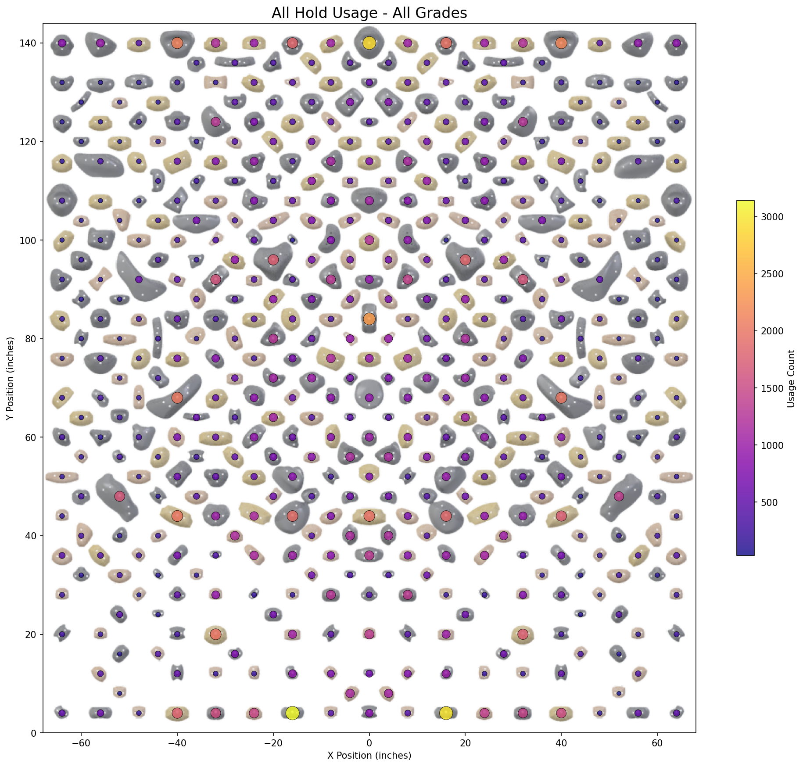

1. [Setup and Reproducibility](#setup-and-reproducibility)
2. [Part I — Data Analysis (Notebooks 01–03)](#part-i--data-analysis-notebooks-0103)
3. [Part II — Predictive Modelling (Notebooks 04–06)](#part-ii--predictive-modelling-notebooks-0406)
4. [Using the Trained Model](#using-the-trained-model)

## Overview

This project analyzes ~130,000 climbs from the Tension Boards in order to do the following.
> 1. **Understand** hold usage patterns and difficulty distributions
> 2. **Quantify** empircal hold difficulty scores
> 3. **Predict** climb grades from hold positions and board angle

Climbing grades are inherently subjective. Different climbers use different beta, setters have different grading standards, and difficulty depends on factors not always captured in data. What makes it harder in the case of the board climbing is that the grade is displayed almost democratically -- it is determined by user input. 

Using a Tension Board (2) dataset, this project combines:

* SQL-based data exploration
* statistical analysis and visualization
* feature engineering
* machine learning and deep learning

The project is intentionally structured in two parts:

* **Part I — Data Analysis**
* **Part II — Predictive Modelling**

---

## Project Structure

```text
data/        # processed datasets and feature tables
images/      # saved visualizations used in README and analysis
models/      # trained models and scalers
notebooks/   # full pipeline (01–06)
scripts/     # utility + prediction scripts
sql/         # SQL exploration
README.md
```

---

# Setup and Reproducibility

## Requirements

```bash
pip install requirements.txt
```

---

## Retrieving the Data

The utility [`BoardLib`](https://github.com/lemeryfertitta/BoardLib) is used for interacting with climbing board APIs, and works with all Aurora Climbing boards. 
We'll work with the Tension Board 2. I downloaded TB2 data as `tb2.db`, and I also downloaded the images.

```bash
# install boardlib (also in requirements.txt)
pip install boardlib

# download the database
boardlib database tension data/tb2.db

# download the images
# this puts the images into images/product_sizes_layouts_sets
boardlib images tension tb2.db images
```

**Note**. I downloaded the database in March 2026, and the data was last updated on 2026-01-22. There is no user data in this database. The image I use to overlay the heatmaps on is `images/tb2_board_12x12_composite.png`. It is just the two following images put together: 

* `images/product_sizes_layouts_sets/21-2.png` 
* `images/product_sizes_layouts_sets/22-2.png` 


---

## Running the project

Go to your working directory and run notebooks in order:

```text
01 -> 02 -> 03 -> 04 -> 05 -> 06
```

Note:

* Notebooks 01-03 are uploaded with all of their cells run, so that one can see the data analysis. Notebooks 04-06 are uploaded without having been run.
* Notebook 03 generates hold difficulty tables
* Notebook 04 generates feature matrix
* Notebook 05 trains models
* Notebook 06 trains neural network

---

# Part I — Data Analysis (Notebooks 01–03)

This section focuses on **understanding the data**, identifying patterns, and forming hypotheses. We start off by mentioning that we don't have any user data. We are still able to determine some user-trends from features of climbs like `fa_at` (when it was first ascented) and `ascensionist_count` (how many people have logged an ascent) from the `climbs` and `climb_stats` tables, but that's about it. 

---

## 1. Data Overview and Climbing Statistics

There are about 30 tables in this database, about half of which contain useful information. See [`sql/01_data_exploration.sql`](sql/01_data_exploration.sql) for the full exploration of tables. We examine many climbing statistics, starting off with grade distribution.

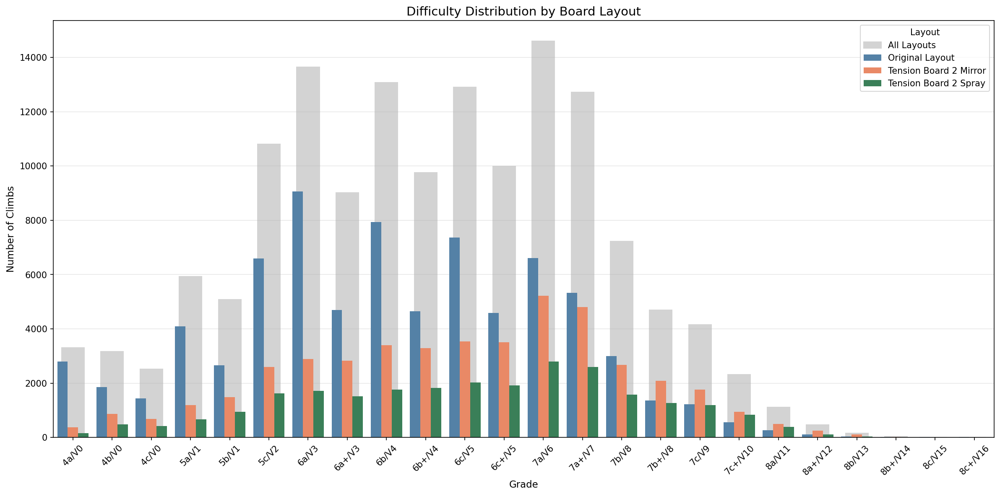

* Grade distribution is skewed toward mid-range climbs
* Extreme difficulties are relatively rare
* Multiple entries per climb reflect angle variations

---

## 2. Climbing Popularity and Temporal Patterns

Beyond structural analysis, we can also study how board-climbers behave over time (despite the lack of user data). 

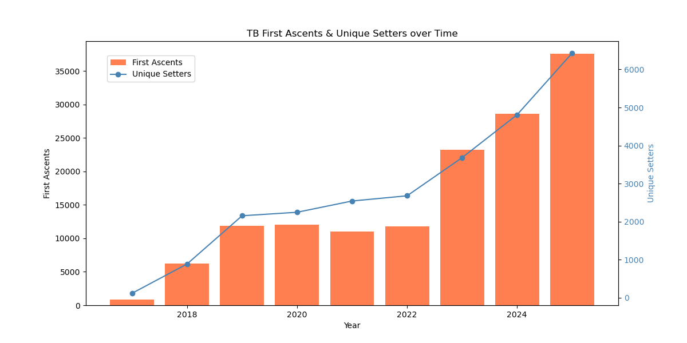
* General uptrend of popularity over the years, both in term of first ascents and unique setters


---

## 3. Angle vs Difficulty

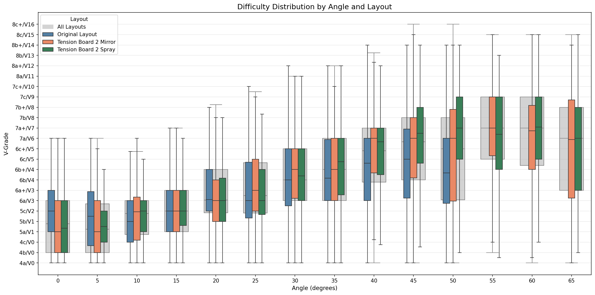

* Wall angle is one of the strongest predictors of difficulty
* Steeper climbs tend to be harder
* Significant variability remains within each angle
* Things tend to stabilize past 50 degrees

---

## 4. Board Structure and Hold Usage

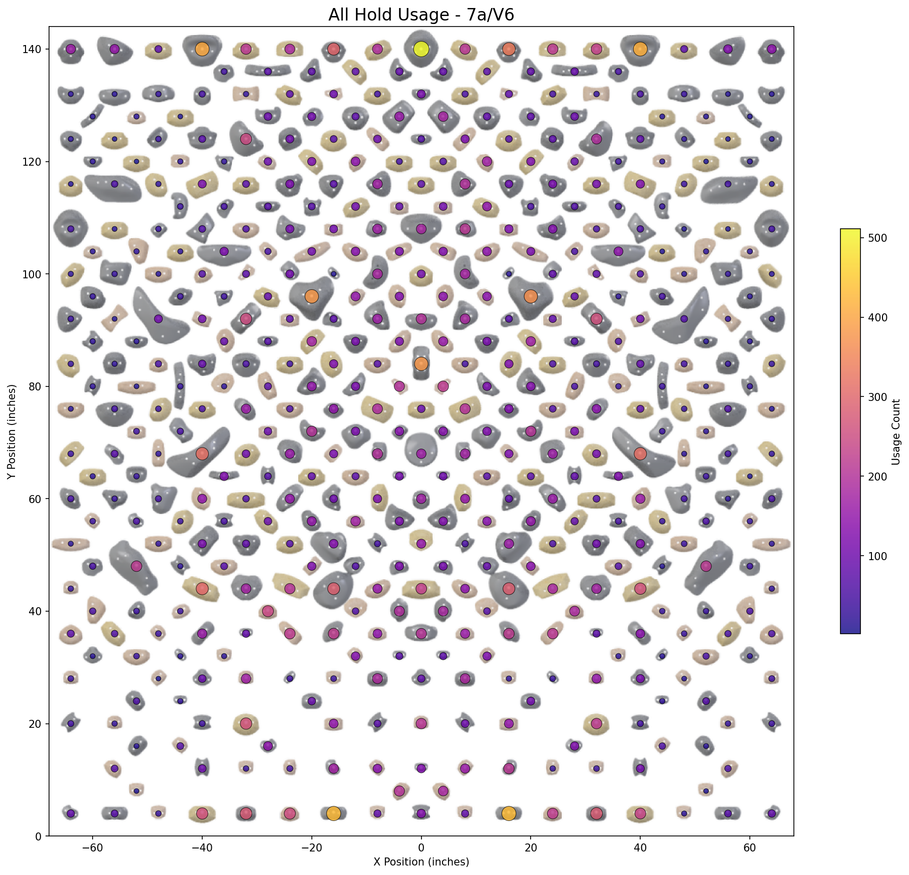

* Hold usage is highly non-uniform
* Certain board regions are heavily overrepresented
* Spatial structure plays a key role in difficulty

---

## 5. Hold Difficulty Estimation

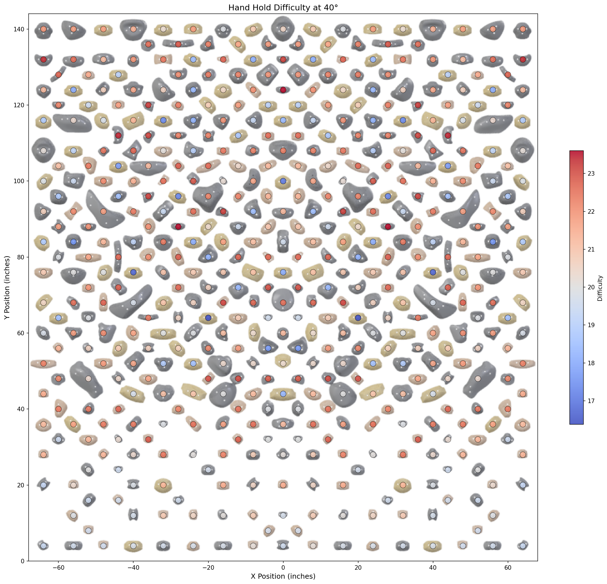

* Hold difficulty is estimated from climb data
* We averaged (pre-role/per-angle) difficulty for each hold (with Bayesian smoothing)
* Took advantage of the mirrored layout to increase the amount of data per hold

### Key technique: Bayesian smoothing

Raw averages are noisy due to uneven usage. To stabilize estimates:

* frequently used holds retain their empirical difficulty
* rarely used holds are pulled toward the global mean

This significantly improves downstream feature quality.
 
---

## 6. Many more!

There are many other statistics, see notebooks [`01`](notebooks/01_data_overview_and_climbing_statistics.ipynb) (climbing statistics), [`02`](notebooks/02_hold_analysis_and_board_heatmaps.ipynb) (climbing hold statistics), and [`03`](notebooks/03_hold_difficulty.ipynb). Included are:

* **Time-Date analysis** based on `fa_at`. We include month, day of week, and time analysis based on first ascent log data. Winter months are the most popular, and Tuesday and Wednesday are the most popular days of the week.
* **Distribution of climbs per angle**, with 40 degrees being the most common.
* **Distribution of climb quality**, along with the relationship between quality & angle + grade.
* **"Match" vs "No Match"** analysis (whether or not you can match your hands on a hold). "No match" climbs are fewer, but harder and have more ascensionists
* **Prolific statistics**: most popular routes & setters
* **Plastic vs wood** hold analysis
* **Per-Angle, Per-Grade** hold frequency & difficulty analyses

---

# Part II — Predictive Modelling (Notebooks 04–06)

This section focuses on **building predictive models and evaluating performance**. We will build features from the `angle` and `frames` of a climb (the `frames` feature of a climb tells us which hold to use and which role it plays). 

---

## 7. Feature Engineering

Features are constructed at the climb level using:

* geometry (height, spread, convex hull)
* structure (number of moves, clustering)
* hold difficulty (smoothed estimates)
* interaction features


| Category      | Description                       | Examples                                    |
| ------------- | --------------------------------- | ------------------------------------------- |
| Geometry      | Shape and size of climb           | bbox_area, range_x, range_y                 |
| Movement      | Reach and movement complexity     | max_hand_reach, path_efficiency             |
| Difficulty    | Hold-based difficulty metrics     | mean_hold_difficulty, max_hold_difficulty   |
| Progression   | How difficulty changes over climb | difficulty_gradient, difficulty_progression |
| Symmetry      | Left/right balance                | symmetry_score, hand_symmetry               |
| Clustering    | Local density of holds            | mean_neighbors_12in                         |
| Normalization | Relative board positioning        | mean_y_normalized                           |
| Distribution  | Vertical distribution of holds    | y_q25, y_q75                                |

### Important design decision

The dataset is restricted to:

> **climbs with angle ≤ 50°**

to reduce variability and improve consistency. (see [Angle vs Difficulty](#3-angle-vs-difficulty), where average climb grade seems to stabilize or get lower over 50°)

---

## 8. Feature Relationships

Here are some relationships between features and difficulty

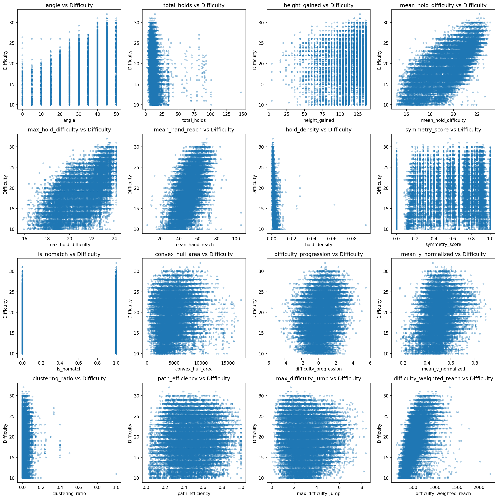

* higher angles allow for harder difficulties
* hold difficulty features seem to correlate the most to difficulty
* engineered features capture non-trivial structure

We have a full feature list in [`data/04_climb_features/feature_list.txt`](data/04_climb_features/feature_list.txt). Explanations are available in [`data/04_climb_features/feature_list_explanations.txt`](data/04_climb_features/feature_explanations.txt).

---

## 9. Predictive Models


Models tested:

* Linear Regression
* Ridge
* Lasso
* **Random Forest**
* Gradient Boosting
* **Neural Networks**

### Feature importance

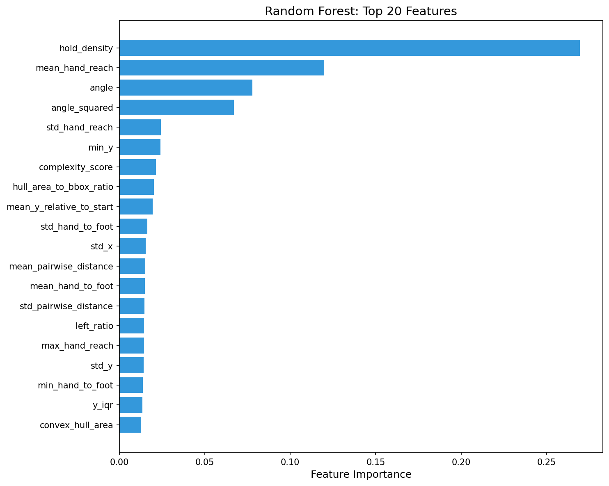
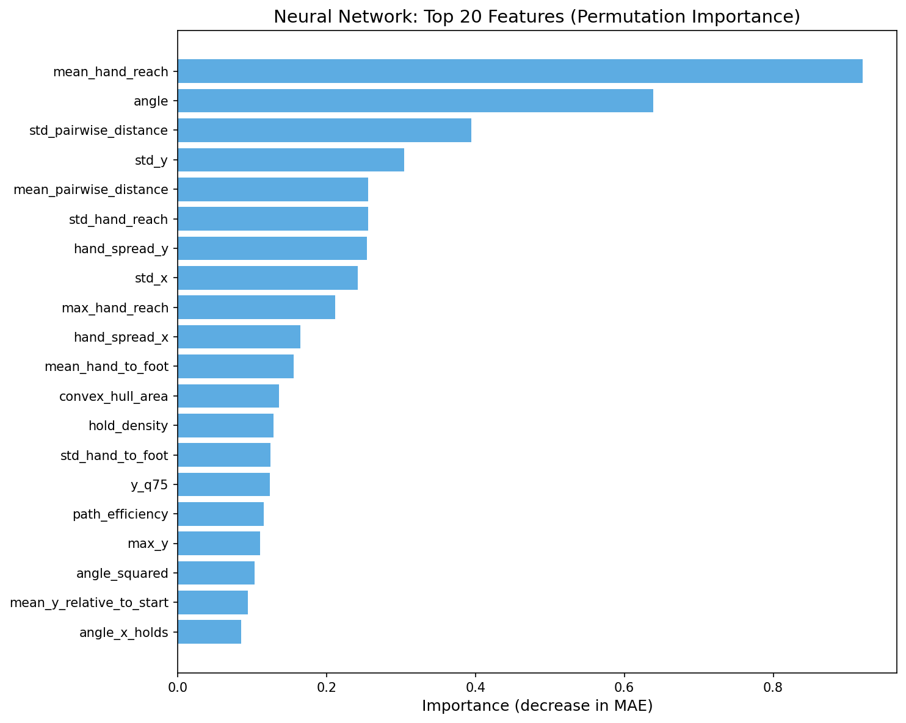

Key drivers:

* hold difficulty
* wall angle
* structural features

---

## 10. Model Performance

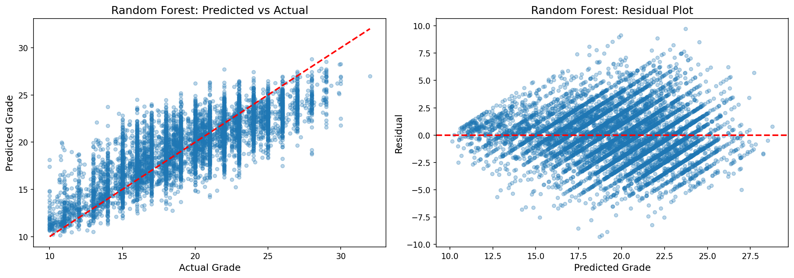
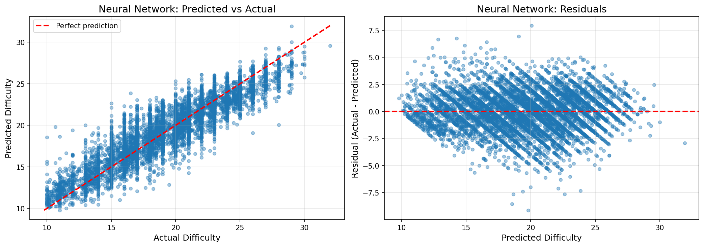

### Results (in terms of difficulty score)
Both the RF and NN models performed similarly.
* **~83% within ±1 V-grade (~45% within ±1 difficulty score)**
* **~96% within ±2 V-grade (~80% within ±2 difficulty scores)**


### Interpretation

* Models capture meaningful trends
* Exact prediction is difficult due to:

  * subjective grading
  * missing beta (movement sequences)
  * climber variability

---

# Results Summary

| Metric             | Performance |
| ------------------ | ----------- |
| Within ±1 V-grade  | ~83%        |
| Within ±2 V-grades | ~96%        |

The model can still predict subgrades (e.g., V3 contains 6a and 6a+), but it is not as accurate.

| Metric             | Performance |
| ------------------ | ----------- |
| Within ±1 difficulty-grade  | ~45%        |
| Within ±2 difficulty-grades | ~80%        |

---

# Limitations

* No explicit movement / beta information
* Grading inconsistency
* No climber-specific features
* Dataset noise
* Some nonsensical grades. For example `Wayward Son` has the following grades, while it is a more difficult climb at 45 degrees.
> | name       |angle|display_difficulty|
> | -----------|-----|------------------|
> | Wayward Son|   35|              14.0 (5b/V1)|
> | Wayward Son|   45|           11.9929 ~ 12 (4c/V0)|

---

# Future Work

* Kilter Board analysis
* Test other models
* Better spatial features
* GUI to create climb and instantly tell you a predicted difficulty

---

# Using the Trained Model

## Load model in Python

```python
import joblib

model = joblib.load('models/random_forest_tuned.pkl')
```

---

## Predict from feature matrix

```python
import pandas as pd

df = pd.read_csv('data/04_climb_features/climb_features.csv')
X = df.drop(columns=['climb_uuid', 'display_difficulty'])

predictions = model.predict(X)
```

---

## Model files

* `models/random_forest_tuned.pkl` — trained Random Forest

---
## Using the Prediction Script

The repository includes a prediction script that can estimate climb difficulty directly from:

* wall angle
* `frames` string
* optional metadata such as `is_nomatch` and `description`

The script reconstructs the engineered feature vector used during training, applies the selected model, and returns:

* predicted numeric difficulty
* rounded display difficulty
* mapped boulder grade

### Supported models

The script supports the following trained models:

* `random_forest` — default and recommended
* `linear`
* `ridge`
* `lasso`
* `nn` — alias for the best neural network checkpoint
* `nn_best`

### Single-climb prediction

Example:

```bash
python scripts/predict.py --angle 35 --frames 'p304r8p378r6p552r6p564r7p582r5p683r8p686r7' --model random_forest
```

Example output:

```python
{
    'predicted_numeric': 14.27,
    'predicted_display_difficulty': 14,
    'predicted_boulder_grade': '5b/V1',
    'model': 'random_forest'
}
```

You can also use the neural network:

```bash
python scripts/predict.py --angle 40 --frames 'p344r5p348r8p352r5p362r6p366r8p367r8p369r6p371r6p372r7p379r8p382r6p386r8p388r8p403r8p603r7p615r6p617r6' --model nn
```

### Batch prediction from CSV

The same script can run predictions for an entire CSV file.

#### Required columns

* `angle`
* `frames`

#### Optional columns

* `is_nomatch`
* `description`

#### Example input CSV

```csv
angle,frames,is_nomatch,description
40,p344r5p348r8p352r5p362r6,0,
35,p304r8p378r6p552r6p564r7,1,no matching
```

#### Run batch prediction

```bash
python scripts/predict.py --input_csv data/new_climbs.csv --output_csv data/new_climbs_with_predictions.csv --model random_forest
```

This appends prediction columns to the original CSV, including:

* `predicted_numeric`
* `predicted_display_difficulty`
* `predicted_boulder_grade`
* `model`

### Evaluate predictions on labeled data

If your CSV also contains a true difficulty column named `display_difficulty`, the script can compute simple evaluation metrics:

```bash
python scripts/predict.py --input_csv data/test_climbs.csv --output_csv data/test_preds.csv --model random_forest --evaluate
```

Reported metrics include:

* mean absolute error
* RMSE
* fraction within ±1 grade
* fraction within ±2 grades

### Python usage

You can also call the prediction function directly:

```python
from scripts.predict import predict

result = predict(
    angle=40,
    frames="p344r5p348r8p352r5p362r6",
    model_name="random_forest"
)

print(result)
```

### Notes

* `random_forest` is the recommended default model for practical use.
* Linear, ridge, lasso, and neural network models are included for comparison.
* The prediction pipeline depends on the same engineered features used during model training, so the script internally reconstructs these from raw route input.
* The neural network checkpoints are loaded from saved PyTorch state dictionaries using the architecture defined in the project.

---


# License

This project is licensed under the MIT License. See the [`LICENSE`](LICENSE) file for details.

The project is for educational purposes. Climb data belongs to Tension Climbing.
